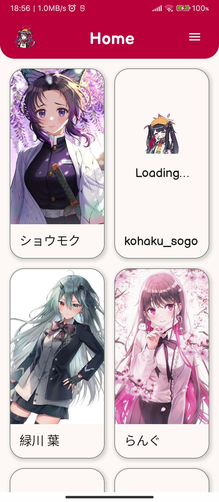
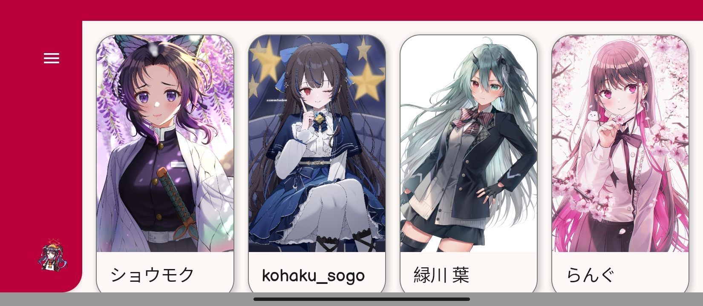
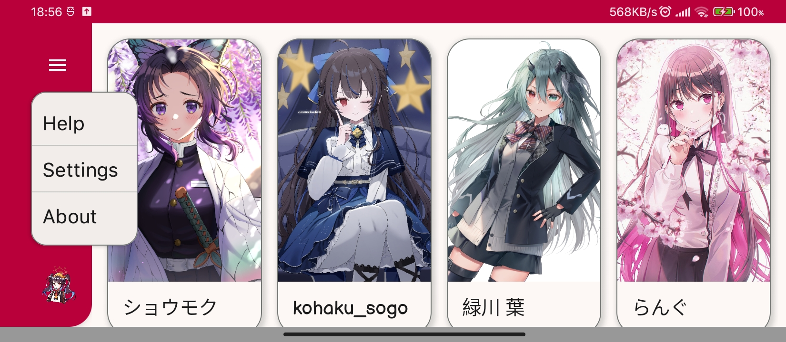

# ❤️ Hey, there! ❤️

## Technical

### Limitation and plan

1. Currently, the only supported API is https://nekos.best/api/v2. I plan to
support more APIs in the future. `Important`
2. I will implement `offline-first` principle in the future. `Important`
3. Support for expanded screen (>= 840 DP). `Plan`
4. Dependency injection with Hilt. `Important`
5. Implement the help, settings, and about screen. `Plan`
6. Fix the dark screen for splash screen. `Important`
7. Add cute toggle-able background music. `Important`
8. Add more animations such as state change upon ApiState is changing.
`Important`
9. Implement single source of truth for Gradle build properties with `buildSrc`.
`Critical`
10. Expand the Compose `lazyList` to act similar to Android view's `Paging 3`.
`Important`
11. Make the Coil's image loader to auto reload 3 seconds upon encountering
error. `Critical`
12. To be added.

### Plan levels information

1. `Critical`: the most urgent, will be prioritised over anything else
including bugs and errors.
2. `Important`: important and will be implemented in the near future.
3. `Plan`: important and will be implemented only after everything which is more
important than this no longer exist.

### Pull and feature requests

Talking is cheap, send patches. If you wish a bug to be fixed or something
to be added, send the solution: be it the code or the illustration. Otherwise
sit down and shut up. I am sorry, I really appreciate your enthusiasm and I
adore it, really; but I don't wish to give you false hope or bad impression
about me.

## Legal

Although I try to avoid anything related to legal/law stuffs, it's inevitable.

```
The source code is licensed beneath GNU GPLv3.

The work of arts, including but not limited to, embedded pictures, fonts, or
musics, is owned by its author and I do not have any right upon it.

If the author of aforementioned work-of-arts wishes to be credited or even
delete their work from this repository, please contact me immediately through
this repository. There's no need to be sentimental. You wish something, say it,
and I will help you. Problem solved.
```

Yes, you read it right. `GNU GPLv3`. Why? Because in a matter of knowledge,
I am a communist: knowledge `must` be free. Heck, even in these days of free
knowledge everywhere, many people are even dumber every second.

But fear not, dear. I will not do things that are destructive, harmful, or
against the laws. When I say that knowledge must be free, this is the proof of
my will: I expose my knowledge to the world for free. See the difference?
Instead of changing others actions, I change mine! `:3`

## Backgrounds

### What is this?

This repository is the source code of `Mein Waifu` Android application. It is
made with Kotlin Compose. The purpose of this project is to serve as both
challenge and proof of  my Kotlin coding skill.

The application's name `Mein Waifu` roughly means "my waifu" in English. I got
the inspiration of using Germanic word because of Dutch colonialism in East Indie
(Netherlands-Indie, now known as Indonesia). But, ignorantly I mistook the word
"mein" (Deutsch/German) instead of "mijn" (Dutch/Netherlands). Since both are
Germanic languages, I leave it as is.

Oh, and don't get me wrong. I am opposed to colonialism. But I admire their
sheer will and ability for conquering such vast amount of lands, **without
smartphones, Minecraft: PE, and AirPods**. Many of their infrastructures are
also still on duty until this second. That's a whole another league of
engineering level.

### Screenshots




